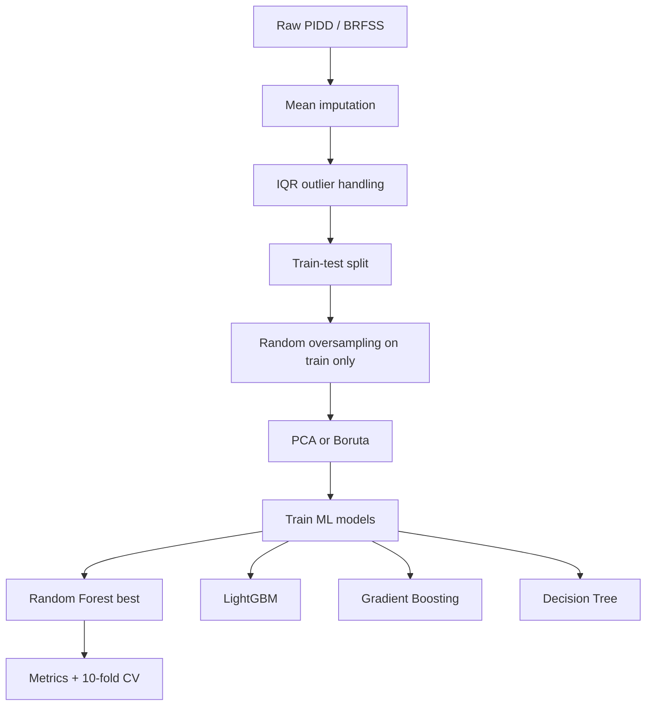

# Architecture - Layer 1: Pipeline nền tảng

## Đọc 1 phút

| Thành phần | Nội dung |
|---|---|
| Input | PIDD/PIMA + BRFSS tabular data |
| Target | Diabetes / non-diabetes |
| Preprocess | Mean imputation, IQR outlier removal |
| Balance | Random oversampling |
| Feature | PCA hoặc Boruta |
| Models | LightGBM, Gradient Boosting, Random Forest, Decision Tree |
| Best path | Boruta → Random Forest |
| Output | Class prediction + metrics |

## 1. Dataset

| Dataset | Loại | Mẫu | Feature | Label | Điểm cần nhớ |
|---|---|---:|---:|---|---|
| PIDD/PIMA | Clinical benchmark (NIDDK) | 768 | 8 + label | `Outcome` (1/0) | Chỉ nữ PIMA Indian population near Phoenix, Arizona |
| BRFSS | Public health survey (CDC) | Chưa xác minh được con số cụ thể trong paper trong PDF đã trích | Paper mô tả “wide range of attributes” (demographic, lifestyle, health status); Table 2 liệt kê đầy đủ | `Diabetes` (1/0) | Lớn hơn, thực tế hơn, có self-report bias |

## 2. Feature chính

| Dataset | Feature |
|---|---|
| PIDD/PIMA | pregnancies, plasma glucose (OGTT 2h), diastolic blood pressure, skin fold thickness, 2-hour serum insulin, BMI, diabetes pedigree function, age |
| BRFSS (theo mô tả trong paper) | demographic (age, sex, race, education, income), lifestyle (smoking, alcohol, physical activity, diet), health status (BMI, cholesterol, blood pressure). Danh sách attribute cụ thể ở Table 2 của paper; PDF của project chưa trích đủ cột để liệt kê hết. |

## 3. Kiến trúc pipeline

| Bước | Tên bước | Kỹ thuật | Output |
|---:|---|---|---|
| 1 | Load data | CSV/tabular input | Raw dataframe |
| 2 | Missing handling | Mean imputation | Data không thiếu |
| 3 | Outlier handling | IQR | Data sạch hơn |
| 4 | Split | 70:30 hoặc 80:20 | Train/test |
| 5 | Balance | Random oversampling | Train cân bằng lớp |
| 6 | Feature selection | PCA/Boruta | Feature set gọn hơn |
| 7 | Train | RF/GBC/LightGBM/DT | Classifier |
| 8 | Evaluate | Accuracy, precision, recall, F1 | Model report |
| 9 | Validate | Ten-fold CV | Độ ổn định |

## 4. Model / kỹ thuật

| Kỹ thuật | Vai trò | Mạnh | Yếu |
|---|---|---|---|
| Mean imputation | Điền missing values | Dễ làm | Có thể gây bias |
| IQR | Loại outlier | Robust, đơn giản | Có thể loại điểm hiếm có ý nghĩa y khoa |
| Random oversampling | Cân bằng class | Cải thiện minority class | Dễ overfit/leakage |
| PCA | Giảm chiều | Giảm nhiễu | Khó giải thích lâm sàng |
| Boruta | Chọn feature | Hợp với RF, giữ ý nghĩa feature | Dễ leakage nếu fit sai |
| Decision Tree | Baseline | Dễ giải thích | Dễ overfit |
| Gradient Boosting | Model mạnh | Bắt quan hệ phi tuyến | Cần tuning |
| LightGBM | Model tabular mạnh | Nhanh, hiệu quả | Cần tuning |
| Random Forest | Model tốt nhất | Ổn định, mạnh với tabular data | Cần XAI để giải thích tốt |

## 5. Đường đi tốt nhất theo paper

## 6. Cảnh báo kiến trúc

| Lỗi dễ mắc | Hậu quả | Cách làm đúng |
|---|---|---|
| Oversampling trước split | Test bị lộ, accuracy ảo | Split trước, oversample train only |
| Fit imputer toàn dataset | Test statistics bị lộ | Fit imputer trên train |
| Fit Boruta/PCA toàn dataset | Feature selection biết test | Fit selector trên train |
| Test trên data oversampled | Metric không thật | Test trên original hold-out |
| Chỉ nhìn accuracy | Bỏ qua false negative/false positive | Báo cáo recall, specificity, ROC-AUC |

## 7. Link liên quan

| Loại | Link |
|---|---|
| Paper | https://link.springer.com/article/10.1007/s44196-024-00678-3 |
| DOI | https://doi.org/10.1007/s44196-024-00678-3 |
| PIMA dataset | https://data.world/uci/pima-indians-diabetes |
| BRFSS dataset | https://www.kaggle.com/datasets/cdc/behavioral-risk-factor-surveillance-system |
| Code | Chưa tìm thấy link code chính thức trong paper |
| Demo | Chưa có web/app demo trong paper |
