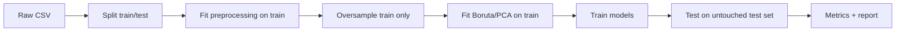

# Deploy / Reproduction - Layer 1: Pipeline nền tảng

## Đọc 1 phút

| Muốn làm lại cần gì? | Trả lời |
|---|---|
| Dataset | PIDD/PIMA, BRFSS |
| Tool | Python, pandas, scikit-learn, imbalanced-learn, LightGBM, BorutaPy |
| Model chính | Random Forest + Boruta |
| Metric | Accuracy, precision, recall, F1, ROC-AUC |
| Lỗi cần tránh | Data leakage |
| Demo được không? | Được, nhưng chỉ nên gọi là screening support |

## 1. Mục tiêu tái lập

| Mục tiêu | Có/không |
|---|---|
| Tái lập pipeline sạch | Có |
| So sánh nhiều model | Có |
| Đạt đúng 94% accuracy | Không bắt buộc |
| Chứng minh dùng lâm sàng | Không |
| Làm demo web/app | Có thể, nhưng paper chưa làm |

## 2. Input cần chuẩn bị

| Nhóm | Cần chuẩn bị |
|---|---|
| Data | PIDD/PIMA CSV, BRFSS CSV |
| Python libs | pandas, numpy, scikit-learn, imbalanced-learn, lightgbm, matplotlib, seaborn, BorutaPy |
| Output | Metrics table, confusion matrix, ROC curve, trained model |
| Notebook | Jupyter/Colab đủ dùng |

## 3. Checklist tái lập

| Bước | Việc làm | Ghi chú |
|---:|---|---|
| 1 | Load dataset | Kiểm tra schema |
| 2 | Check class balance | Biết minority/majority |
| 3 | Stratified train-test split | Split trước mọi bước học từ data |
| 4 | Fit imputer trên train | Transform train/test |
| 5 | IQR handling | Tránh dùng test để đặt rule |
| 6 | Oversampling train only | Không oversample test |
| 7 | Fit Boruta/PCA trên train | Transform test |
| 8 | Train RF/GBC/LightGBM/DT | Cùng setting so sánh |
| 9 | Evaluate original test | Không test trên synthetic/duplicated data |
| 10 | Cross-validation bằng pipeline | Tránh leakage trong từng fold |
| 11 | Ghi limitation | Dataset nhỏ, bias, chưa external validation |

## 4. Pseudocode gọn

```python
data = load_csv("pima.csv")
X, y = split_features_label(data, label="Outcome")

X_train, X_test, y_train, y_test = train_test_split(
    X, y, test_size=0.2, stratify=y, random_state=42
)

imputer.fit(X_train)
X_train = imputer.transform(X_train)
X_test = imputer.transform(X_test)

X_train, y_train = remove_outliers_iqr(X_train, y_train)

X_train, y_train = RandomOverSampler(random_state=42).fit_resample(
    X_train, y_train
)

selector.fit(X_train, y_train)
X_train = selector.transform(X_train)
X_test = selector.transform(X_test)

model = RandomForestClassifier(random_state=42)
model.fit(X_train, y_train)

y_pred = model.predict(X_test)
y_prob = model.predict_proba(X_test)[:, 1]

report_metrics(y_test, y_pred, y_prob)
```

## 5. Sơ đồ làm đúng



## 6. Demo nhanh

| Cách demo | Mô tả | Phù hợp |
|---|---|---|
| Notebook | Train + evaluate + plot | Báo cáo nghiên cứu |
| Streamlit/Gradio | Nhập feature, trả risk/class | Demo nhanh |
| Flask/FastAPI | Backend predict API | App nghiêm túc hơn |
| Mobile/IoMT | Thu input từ thiết bị | Chưa nên làm ở Layer 1 |

## 7. Cảnh báo bắt buộc

| Cảnh báo | Vì sao |
|---|---|
| Không chẩn đoán y khoa | Model chỉ classification/screening |
| Không oversample trước split | Leakage lớn |
| Không fit selector trên full data | Test bị lộ |
| Không chỉ báo accuracy | Diabetes screening cần recall/specificity |
| Không khái quát từ PIMA | Dataset nhỏ, bias dân số |
| Không bỏ privacy | Data thật cần bảo mật |
