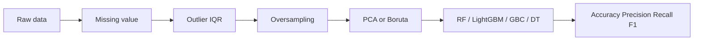

# Overview - Layer 1: Pipeline nền tảng

## Đọc 1 phút

| Câu hỏi | Trả lời ngắn |
|---|---|
| Paper làm gì? | Phân loại diabetes bằng ML trên dữ liệu tabular |
| Dataset | PIDD/PIMA + BRFSS |
| Pipeline chính | Missing value → outlier → oversampling → feature selection → ML model |
| Model tốt nhất | Random Forest + Boruta |
| Kết quả chính | 94% accuracy trên PIDD, 92% trên BRFSS |
| Vai trò trong đề tài | Baseline pipeline cho layer sau |
| Cần cảnh giác | Data leakage do oversampling/feature selection nếu làm sai thứ tự |
| Kết luận dùng được không? | Hỗ trợ sàng lọc/nghiên cứu; không thay chẩn đoán y khoa |

## 1. Thông tin paper

| Mục | Nội dung |
|---|---|
| Tên paper | Random Oversampling-Based Diabetes Classification via Machine Learning Algorithms |
| Tác giả | G. R. Ashisha, X. Anitha Mary, E. Grace Mary Kanaga, J. Andrew, R. Jennifer Eunice |
| Năm | 2024 |
| Nguồn | International Journal of Computational Intelligence Systems |
| DOI | 10.1007/s44196-024-00678-3 |
| Link | https://link.springer.com/article/10.1007/s44196-024-00678-3 |
| File PDF | `papers/Random Oversampling-Based Diabetes Classification via Machine Learning Algorithms.pdf` |
| Nguồn trích | Abstract trang 1; Sections 3-5; Tables 3-9 |

## 2. Paper giải quyết gì?

| Thành phần | Nội dung |
|---|---|
| Bài toán | Diabetes classification: diabetic vs non-diabetic |
| Dữ liệu | Dữ liệu y tế dạng bảng |
| Mục tiêu | Phát hiện/sàng lọc sớm nguy cơ diabetes |
| Không phải | Không phải dự đoán theo timeline dài; không phải chẩn đoán y khoa |
| Khó khăn | Missing values, outliers, class imbalance, feature nhiễu |
| Hướng giải | Làm sạch dữ liệu + cân bằng lớp + chọn feature + so sánh ML models |

## 3. Vì sao là Layer 1?

| Lý do | Giải thích |
|---|---|
| Pipeline rõ | Có đủ bước từ raw data đến evaluation |
| Dataset benchmark | PIDD/PIMA dễ tái lập; BRFSS thực tế hơn |
| Model cơ bản | RF, LightGBM, Gradient Boosting, Decision Tree |
| Tạo baseline | Layer 2 nâng cấp bằng ensemble |
| Chưa phải Layer 3 | Chưa dùng EHR/biobank theo timeline lâm sàng |
| Chưa phải Layer 4 | Chưa có XAI/web/app cụ thể |

## 4. Pipeline chính

| Bước | Kỹ thuật | Mục đích |
|---|---|---|
| 1 | Load PIDD/BRFSS | Lấy dữ liệu |
| 2 | Mean imputation | Điền missing values |
| 3 | IQR | Loại outliers |
| 4 | Random oversampling | Cân bằng lớp |
| 5 | PCA/Boruta | Chọn/giảm feature |
| 6 | ML models | Train classifier |
| 7 | Metrics + CV | Đánh giá |

## 5. Điểm mạnh

| Điểm mạnh | Vì sao đáng giá |
|---|---|
| Pipeline đầy đủ | Có preprocessing, balancing, feature selection, model comparison |
| Dùng 2 dataset | PIDD nhỏ nhưng benchmark; BRFSS lớn/thực tế hơn |
| Nhiều model | Không báo cáo một model đơn |
| Nhiều metric | Có accuracy, precision, recall, F1-score |
| Có cross-validation | Kiểm tra độ ổn định |
| Boruta + RF hợp lý | Boruta dựa trên tree importance, RF mạnh với tabular data |
| Dataset public | Tái lập dễ hơn dataset private |

## 6. Điểm yếu / rủi ro

| Điểm yếu | Rủi ro khi trình bày |
|---|---|
| PIDD nhỏ | 768 mẫu, khó khái quát ra dân số rộng |
| PIDD bias dân số | Chỉ nữ PIMA Indian population |
| BRFSS là survey | Có self-report bias/recall bias |
| Oversampling dễ leakage | Nếu làm trước train-test split, metric cao giả |
| Feature selection dễ leakage | Nếu fit Boruta/PCA trên toàn dataset, test set bị lộ |
| Accuracy cao | 94% cần kiểm tra split/preprocessing |
| Chưa external validation | Chưa chứng minh tốt trên bệnh viện độc lập |
| Chưa có XAI | Khó giải thích cho bác sĩ/người dùng |
| Chưa có app thật | Có hướng IoMT, chưa có web/app triển khai |

## 7. Kết quả chính

| Dataset | Model tốt nhất | Feature method | Accuracy | Ghi chú |
|---|---|---|---:|---|
| PIDD | Random Forest | Boruta | 94% | Table 6 |
| BRFSS | Random Forest | Boruta | 92% | Table 6 |
| PIDD | RF + Boruta | Ten-fold CV | 94.03% | Table 7 |
| BRFSS | RF + Boruta | Ten-fold CV | 92.00% | Table 8 |

## 8. Câu chốt

| Ý chính | Cách nói khi thuyết trình |
|---|---|
| Paper này là nền móng | “Layer 1 xây pipeline ML cơ bản cho diabetes classification.” |
| Model thắng | “Random Forest kết hợp Boruta cho kết quả tốt nhất.” |
| Bài học lớn | “Preprocessing quyết định mạnh đến kết quả.” |
| Cảnh báo lớn | “Cần tránh data leakage khi oversampling và feature selection.” |
| Giới hạn | “Kết quả chỉ nên xem như sàng lọc/hỗ trợ, không thay chẩn đoán.” |
