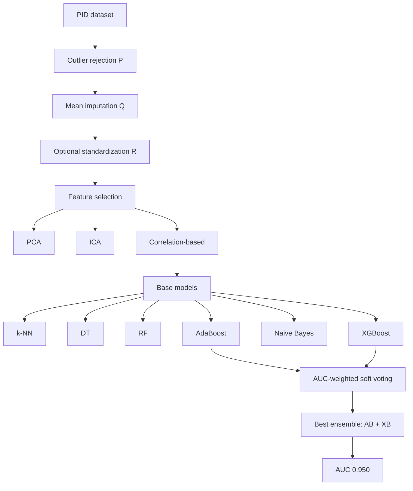

# Architecture - Layer 2: Model hiệu quả

## Đọc 1 phút

| Thành phần | Nội dung |
|---|---|
| Input | PIMA/PID tabular data |
| Preprocess | Outlier rejection, mean imputation, standardization |
| Feature selection | PCA, ICA, correlation-based |
| Base models | k-NN, DT, RF, AdaBoost, Naive Bayes, XGBoost |
| Deep baseline | MLP |
| Ensemble | AUC-weighted soft voting |
| Best route | P + Q + correlation features → AdaBoost + XGBoost |
| Output | Diabetes/non-diabetes + probability |

## 1. Dataset

| Mục | Nội dung |
|---|---|
| Dataset | PIMA Indians Diabetes / PID |
| Public | Có |
| Số mẫu | 768 |
| Positive | 268 diabetic |
| Negative | 500 non-diabetic |
| Đối tượng | Nữ PIMA Indian population near Phoenix, Arizona |
| Feature | 8 attributes |
| Label | Diabetes present / not present |
| Link data | https://www.kaggle.com/uciml/pima-indians-diabetes-database |

## 2. Feature PIMA

| Feature | Ý nghĩa ngắn |
|---|---|
| Pregnancies | Số lần mang thai |
| Glucose | Plasma glucose |
| BloodPressure | Diastolic blood pressure |
| SkinThickness | Triceps skin fold thickness |
| Insulin | 2-hour serum insulin |
| BMI | Body mass index |
| DiabetesPedigreeFunction | Yếu tố di truyền/gia đình |
| Age | Tuổi |
| Outcome | Label diabetes |

## 3. Pipeline tổng thể

| Bước | Kỹ thuật | Mục đích |
|---:|---|---|
| 1 | Load PID | Lấy tabular data |
| 2 | Outlier rejection `P` | Loại điểm lệch bằng IQR |
| 3 | Missing imputation `Q` | Điền null/missing bằng mean |
| 4 | Standardization `R` | Z-score normalization |
| 5 | Feature selection | PCA / ICA / correlation-based |
| 6 | Stratified 5-fold CV | Giữ tỷ lệ class |
| 7 | Grid search | Tuning hyperparameter |
| 8 | Train base models | k-NN, DT, RF, AB, NB, XB |
| 9 | Train MLP | Baseline neural network |
| 10 | Weighted ensemble | Soft voting, weight = AUC |
| 11 | Evaluation | Sn, Sp, Pr, FOR, DOR, AUC |



## 4. Ensemble architecture

| Thành phần | Cách hoạt động |
|---|---|
| Input model output | Mỗi classifier trả probability cho class diabetes/non-diabetes |
| Weight | AUC của classifier đó |
| Aggregation | Weighted soft voting |
| Final class | Class có weighted probability cao nhất |
| Best combo | AdaBoost + XGBoost |
| Lý do | AdaBoost = sequential boosting; XGBoost = gradient/parallel boosting |

Công thức ý tưởng:

```text
final_probability(class_i)
= sum(AUC_model_j * probability_model_j(class_i)) / sum(AUC_model_j)
```

## 5. Model / kỹ thuật

| Kỹ thuật | Vai trò | Mạnh | Yếu |
|---|---|---|---|
| IQR outlier rejection | Làm sạch dữ liệu | Giảm skewness/kurtosis | Có thể loại điểm hiếm có ý nghĩa |
| Mean imputation | Điền missing/null | Giữ lại mẫu | Có thể gây bias |
| Standardization | Scale feature | Hữu ích với distance-based model | Tree-based model không luôn hưởng lợi |
| PCA | Feature reduction | Giảm chiều | Unsupervised, có thể mất signal label |
| ICA | Feature transformation | Tách component độc lập | Có thể mất correlation với label |
| Correlation selection | Chọn feature liên quan label | Hiệu quả nhất trong paper | Dễ leakage nếu làm sai split |
| k-NN | Baseline distance-based | Đơn giản | Nhạy scale/outlier |
| Decision Tree | Baseline dễ hiểu | Explainable | Dễ overfit |
| Random Forest | Bagging model | Ổn định | Không tốt nhất |
| AdaBoost | Sequential boosting | Mạnh với weak learners | Nhạy noise/outlier |
| XGBoost | Gradient boosting | Best single ML AUC 0.946 | Có thể overfit nếu tuning sai |
| MLP | Deep baseline | Có phi tuyến | Data nhỏ, dễ overfit |
| AB+XB ensemble | Best model | AUC 0.950 | Khó giải thích hơn model đơn |

## 6. Cảnh báo kiến trúc

| Lỗi dễ mắc | Hậu quả | Cách làm đúng |
|---|---|---|
| Preprocessing trước CV | Leakage | Fit preprocessing trong từng fold |
| Feature selection trước CV | Test fold lộ label | Selector nằm trong pipeline CV |
| Grid search ngoài fold | Overfit hyperparameter | Inner loop tuning, outer loop eval |
| Chỉ dùng AUC | Bỏ qua false negative | Báo cáo Sn/Sp/FOR/DOR thêm |
| Ensemble quá nhiều model | Không chắc tốt hơn | So sánh combo, chọn theo AUC |
| Dùng PIMA kết luận rộng | Sai ngoại suy | Cần external dataset |

## 7. Link liên quan

| Loại | Link |
|---|---|
| DOI | https://doi.org/10.1109/ACCESS.2020.2989857 |
| Code | https://github.com/kamruleee51/Diabetes-Prediction-Using-MLClassifiers |
| Dataset | https://www.kaggle.com/uciml/pima-indians-diabetes-database |
| Demo | Chưa tìm thấy demo web/app trong paper |
