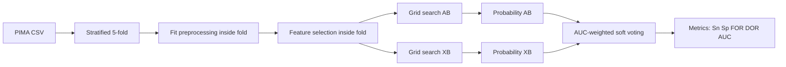

# Deploy / Reproduction - Layer 2: Model hiệu quả

## Đọc 1 phút

| Muốn làm lại cần gì? | Trả lời |
|---|---|
| Dataset | PIMA/PID CSV |
| Code gốc | Có GitHub public |
| Core model | AdaBoost + XGBoost weighted soft voting |
| Weight | AUC từng model |
| CV | Stratified 5-fold + grid search |
| Metric | Sn, Sp, Precision, FOR, DOR, AUC |
| Cẩn thận nhất | Preprocessing/feature selection phải nằm trong CV fold |

## 1. Mục tiêu tái lập

| Mục tiêu | Có/không |
|---|---|
| Tái lập preprocessing | Có |
| Tái lập XGBoost single model | Có |
| Tái lập AB+XB ensemble | Có |
| Đạt y hệt AUC 0.950 | Không bắt buộc |
| Dùng lâm sàng | Không |
| Demo đơn giản | Có thể |

## 2. Input cần chuẩn bị

| Nhóm | Cần chuẩn bị |
|---|---|
| Data | PIMA CSV từ Kaggle |
| Code tham khảo | `kamruleee51/Diabetes-Prediction-Using-MLClassifiers` |
| Python libs | pandas, numpy, scikit-learn, xgboost, matplotlib, seaborn |
| Optional | imbalanced-learn nếu bổ sung pipeline hiện đại |
| Output | Metrics table, ROC curve, confusion matrix, saved model |

## 3. Checklist tái lập

| Bước | Việc làm | Ghi chú |
|---:|---|---|
| 1 | Load PIMA | 768 mẫu, 8 feature |
| 2 | Check missing/outlier | PIMA có zero/null bất thường |
| 3 | Setup stratified 5-fold | Giữ tỷ lệ 268/500 |
| 4 | Trong mỗi fold: fit preprocessing | Không fit toàn dataset |
| 5 | Outlier rejection `P` | IQR |
| 6 | Mean imputation `Q` | Mean trên train fold |
| 7 | Optional standardization `R` | Có thể không giúp tree model |
| 8 | Feature selection | PCA/ICA/correlation-based |
| 9 | Grid search base models | Optimize AUC |
| 10 | Lấy probability output | Cần cho soft voting |
| 11 | Tính AUC từng model | Làm weight |
| 12 | Weighted soft voting | Kết hợp AB + XB |
| 13 | Evaluate | Sn, Sp, Precision, FOR, DOR, AUC |
| 14 | So sánh paper | AUC paper = 0.950 |

## 4. Pseudocode gọn

```python
data = load_pima_csv("diabetes.csv")
X, y = split_features_label(data, label="Outcome")

folds = StratifiedKFold(n_splits=5, shuffle=True, random_state=42)

for train_idx, test_idx in folds.split(X, y):
    X_train, X_test = X.iloc[train_idx], X.iloc[test_idx]
    y_train, y_test = y.iloc[train_idx], y.iloc[test_idx]

    X_train = reject_outliers_iqr_fit_train(X_train)
    X_train, y_train = align_labels_after_outlier_removal(X_train, y_train)

    imputer.fit(X_train)
    X_train = imputer.transform(X_train)
    X_test = imputer.transform(X_test)

    selector.fit(X_train, y_train)
    X_train = selector.transform(X_train)
    X_test = selector.transform(X_test)

    adaboost = grid_search_auc(AdaBoostClassifier(), X_train, y_train)
    xgboost = grid_search_auc(XGBClassifier(), X_train, y_train)

    prob_ab = adaboost.predict_proba(X_test)
    prob_xb = xgboost.predict_proba(X_test)

    auc_ab = roc_auc_score(y_test, prob_ab[:, 1])
    auc_xb = roc_auc_score(y_test, prob_xb[:, 1])

    prob_ensemble = (
        auc_ab * prob_ab + auc_xb * prob_xb
    ) / (auc_ab + auc_xb)

    y_pred = prob_ensemble[:, 1] >= 0.5
    report_metrics(y_test, y_pred, prob_ensemble[:, 1])
```

## 5. Sơ đồ làm đúng



## 6. Demo nhanh

| Cách demo | Mô tả | Phù hợp |
|---|---|---|
| Notebook | Tái lập paper, vẽ ROC/confusion matrix | Báo cáo |
| Streamlit | Nhập 8 feature PIMA, trả probability | Demo lớp học |
| FastAPI | `/predict` endpoint cho app khác gọi | Prototype |
| Web full | Form + backend + model pickle | Có thể làm sau |

## 7. Cảnh báo bắt buộc

| Cảnh báo | Vì sao |
|---|---|
| Không chẩn đoán y khoa | Paper chỉ prediction/classification |
| Không fit preprocessing full data | Leakage |
| Không chọn feature trước CV | Leakage label |
| Không tune hyperparameter trên test fold | Overfit |
| Không tin AUC 0.950 tuyệt đối | PIMA nhỏ, dễ split-dependent |
| Không bỏ specificity/FOR | False negative/false positive đều quan trọng |
| Không dùng PIMA để khái quát dân số Việt Nam | Dataset bias lớn |
