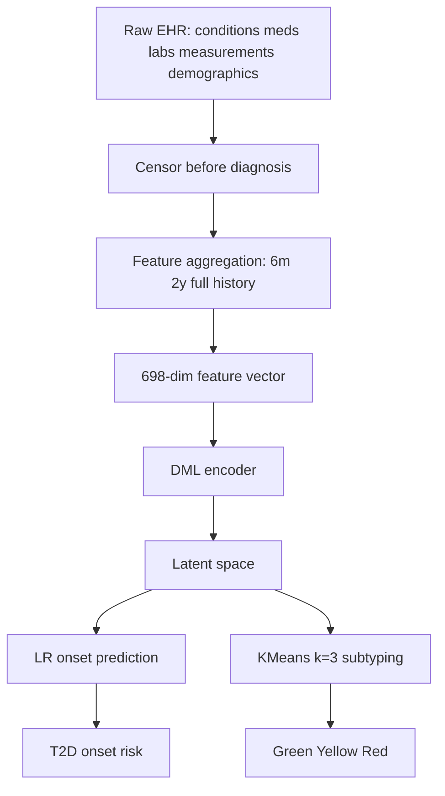
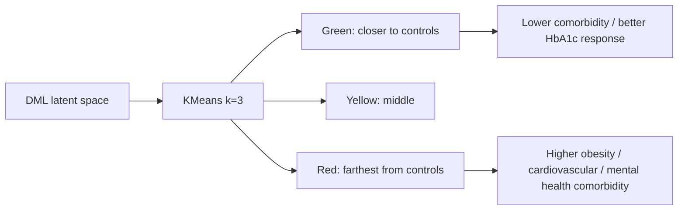

# Architecture - Layer 3: Dataset thực tế / EHR

## Đọc 1 phút

| Thành phần | Nội dung |
|---|---|
| Input | Longitudinal EHR trước censor date |
| Feature | 698-dimensional vector |
| Model | Deep Metric Learning encoder |
| Prediction head | Logistic Regression trên latent representation |
| Subtyping | KMeans k=3 trên latent space |
| Output | T2D onset risk + subtype |
| Subtypes | Green, Yellow, Red |
| Evaluation | AUROC + bootstrap CI + transfer cohort |

## 1. Dữ liệu đầu vào

| Nhóm feature | Số lượng | Cách dùng |
|---|---:|---|
| Conditions | 71 | Binarized / summary across time windows |
| Medications | 89 | Binarized / history indicators |
| Physical measurements | 6 | Mean/min/max |
| Laboratory values | 21 | Mean/min/max |
| Demographics | Age, sex | Age normalized, sex one-hot |
| Total vector | 698 | Concatenate toàn bộ feature |

## 2. Time windows

| Window | Ý nghĩa |
|---|---|
| 6 months | Dữ liệu gần censor date |
| 2 years | Dữ liệu trung hạn |
| Full EHR history | Toàn bộ lịch sử trước censor date |
| Censor rule | Ít nhất 2 năm trước diagnosis, tối đa 10 năm |

Censor rule cực quan trọng: tránh model nhìn thấy dữ liệu quá gần diagnosis hoặc feature tiết lộ label.

## 3. Cohort construction

| Cohort | Cách tạo | Dùng để làm gì |
|---|---|---|
| T2D cases | AoU eMERGE, MGB PheCAP | Positive samples |
| PopControl | Match age, sex, healthcare utilization | Train robust model |
| GenControl | No T2D/T1D codes | Test realistic prevalence |
| Split | 70% train, 10% validation, 20% test | Không overlap patient records |

## 4. Model architecture

| Module | Vai trò |
|---|---|
| DML encoder | Map 698-dim EHR vector sang latent space |
| Layers | 3-4 fully connected layers |
| Activation | ReLU |
| Dropout | p = 0.2 |
| Latent dimension | 32 hoặc 64 |
| Loss candidates | Triplet, N-pair, Lifted, ProxyNCA |
| Optimizer | Adam, learning rate 1e-4 |
| Epochs | 50 |
| Prediction head | Logistic Regression trên latent representation |
| Subtyping | KMeans k=3 trên T2D-positive latent representations |

## 5. Prediction task

| Thành phần | Nội dung |
|---|---|
| Task | Predict T2D onset 2-7 years before diagnosis |
| Main metric | AUROC |
| Baselines | LR full EHR, Risk-Factors, Glycemic |
| Deep baselines | SCARF, TabTransformer, CVAE, ConvAE |
| Dimensional baselines | PCA, UMAP |
| Best | DML |

## 6. Subtyping task

| Subtype | Vị trí latent space | Ý nghĩa ngắn |
|---|---|---|
| Green | Gần controls nhất | Ít comorbidity hơn, response metformin tốt hơn |
| Yellow | Trung gian | Risk/complication trung bình |
| Red | Xa controls nhất | BMI/comorbidity/complication cao hơn |

## 7. Evaluation design

| Đánh giá | Cách làm |
|---|---|
| AUROC | Main metric cho onset prediction |
| Confidence interval | 500 bootstrap iterations |
| Hold-out test | 20% independent test |
| Transfer | Train MGB, evaluate AoU |
| Subtype validation | Comorbidity rates, medication response, PRS |
| Statistical tests | Chi-square, ANOVA, binomial proportion, KS test |
| Multiple testing | Bonferroni correction 0.05/50 = 0.001 |

## 8. Cảnh báo kiến trúc

| Lỗi dễ mắc | Hậu quả | Cách làm đúng |
|---|---|---|
| Dùng feature sau diagnosis | Leakage cực lớn | Censor trước diagnosis |
| Giữ proxy T2D indicators | Model học label shortcut | Loại complication/proxy T2D features |
| Split theo record thay vì patient | Patient leakage | No overlap patient records |
| Train/test cùng hospital bias | Generalization ảo | Transfer/external cohort |
| Clusters bị hiểu quá cứng | Sai lâm sàng | Trình bày subtype là continuum |
| Dùng PRS trong training | Không routine clinical | PRS chỉ post hoc validation |

## 9. Link / dữ liệu

| Loại | Nội dung |
|---|---|
| DOI | https://doi.org/10.1038/s41598-025-25759-x |
| AoU | https://www.researchallofus.org/ |
| MGB | Không public |
| Code | Chưa tìm thấy trong paper trích xuất |
| Synthetic MGB examples | Paper nói sẽ release after acceptance |
