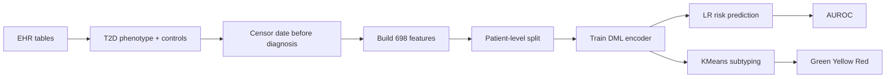

# Deploy / Reproduction - Layer 3: Dataset thực tế / EHR

## Đọc 1 phút

| Muốn làm lại cần gì? | Trả lời |
|---|---|
| Dataset | AoU controlled access; MGB không public |
| Khó nhất | Quyền truy cập EHR + cohort construction |
| Core model | DML encoder + LR head |
| Feature | 698 EHR features |
| Output | T2D risk + subtype |
| Metric | AUROC |
| Cẩn thận nhất | Censor date, proxy leakage, patient-level split |

## 1. Mục tiêu tái lập

| Mục tiêu | Có/không |
|---|---|
| Tái lập full paper y hệt | Khó, vì MGB không public |
| Tái lập trên AoU | Có thể nếu có Researcher Workbench access |
| Tái lập kiến trúc DML | Có |
| Tái lập subtype logic | Có nếu có latent embeddings |
| Demo bằng synthetic/small EHR | Có thể |
| Triển khai lâm sàng | Chưa, cần validation/prospective study |

## 2. Input cần chuẩn bị

| Nhóm | Cần chuẩn bị |
|---|---|
| EHR data | Conditions, medications, measurements, labs, demographics |
| T2D phenotype | eMERGE hoặc PheCAP-like algorithm |
| Controls | PopControl + GenControl |
| Time metadata | Diagnosis date, encounter dates, lab dates |
| Libraries | PyTorch, scikit-learn, pandas, numpy |
| Evaluation | AUROC, bootstrap CI, subtype statistical tests |

## 3. Checklist tái lập

| Bước | Việc làm | Ghi chú |
|---:|---|---|
| 1 | Xin quyền AoU/MGB-like EHR | AoU controlled; MGB private |
| 2 | Xác định T2D cases | eMERGE/PheCAP hoặc rule tương đương |
| 3 | Xác định diagnosis date | Mốc quan trọng cho censor |
| 4 | Tạo censor date | ≥2 năm trước diagnosis, max 10 năm |
| 5 | Loại proxy label | Ví dụ complication due to T2D |
| 6 | Tạo PopControl | Match age/sex/healthcare utilization |
| 7 | Tạo GenControl | No T2D/T1D codes |
| 8 | Build features | 6m, 2y, full history; mean/min/max |
| 9 | Impute missing | Population mean |
| 10 | Split patient-level | 70/10/20, no overlap |
| 11 | Train DML encoder | 3-4 FC layers, dropout 0.2 |
| 12 | Train LR head | On latent representation |
| 13 | Evaluate AUROC | Bootstrap CI |
| 14 | KMeans k=3 | Subtype T2D cases |
| 15 | Validate subtypes | Comorbidity, meds, HbA1c response, PRS |

## 4. Pseudocode gọn

```python
ehr = load_ehr_tables()

t2d_cases = phenotype_t2d_cases(ehr, algorithm="eMERGE_or_PheCAP")
controls = build_controls(ehr, no_t2d_or_t1d=True)

for patient in patients:
    censor_date = set_censor_date(
        diagnosis_date=patient.t2d_diagnosis_date,
        min_years_before=2,
        max_years_before=10,
    )
    features[patient] = build_ehr_features(
        ehr=patient.records_before(censor_date),
        windows=["6_months", "2_years", "full_history"],
        aggregations=["mean", "min", "max"],
        remove_proxy_t2d_features=True,
    )

X = impute_missing_with_population_mean(features)
y = build_labels(t2d_cases, controls)

X_train, X_val, X_test, y_train, y_val, y_test = patient_level_split(
    X, y, ratios=(0.7, 0.1, 0.2)
)

encoder = DMLEncoder(input_dim=698, latent_dim=64, layers=4, dropout=0.2)
train_dml_encoder(
    encoder,
    X_train,
    y_train,
    loss="triplet_or_proxy_nca",
    optimizer="adam",
    lr=1e-4,
    epochs=50,
)

Z_train = encoder.transform(X_train)
Z_test = encoder.transform(X_test)

risk_model = LogisticRegression().fit(Z_train, y_train)
prob = risk_model.predict_proba(Z_test)[:, 1]
auroc = roc_auc_score(y_test, prob)

Z_cases = encoder.transform(X[t2d_cases])
subtypes = KMeans(n_clusters=3).fit_predict(Z_cases)
label_subtypes_by_distance_to_controls(subtypes, names=["Green", "Yellow", "Red"])
```

## 5. Sơ đồ triển khai đúng



## 6. Demo nhanh nếu không có EHR thật

| Cách demo | Mô tả | Phù hợp |
|---|---|---|
| Synthetic EHR | Tạo fake patient features 698-dim | Minh hoạ pipeline |
| Public EHR-like data | Dùng MIMIC/OMOP nếu có quyền | Gần thực tế hơn |
| AoU-only reproduction | Nếu có Researcher Workbench | Tái lập nghiêm túc |
| Slide demo | Vẽ latent space + subtype | Thuyết trình dễ hiểu |
| Web mockup | Nhập EHR summary, trả risk/subtype | Demo concept, không clinical |

## 7. Cảnh báo bắt buộc

| Cảnh báo | Vì sao |
|---|---|
| Không gọi là diagnosis | Paper nói screening/pre-screening |
| Không dùng dữ liệu sau diagnosis | Leakage |
| Không dùng feature tiết lộ T2D | Shortcut label |
| Không split theo record | Patient leakage |
| Không bỏ healthcare utilization bias | EHR phản ánh ai đi khám nhiều |
| Không coi subtype là nhóm cứng | Paper nói continuum |
| Không tái lập full nếu thiếu MGB | MGB không public |
| Không deploy thật khi chưa prospective validation | Chưa chứng minh cải thiện outcome |
