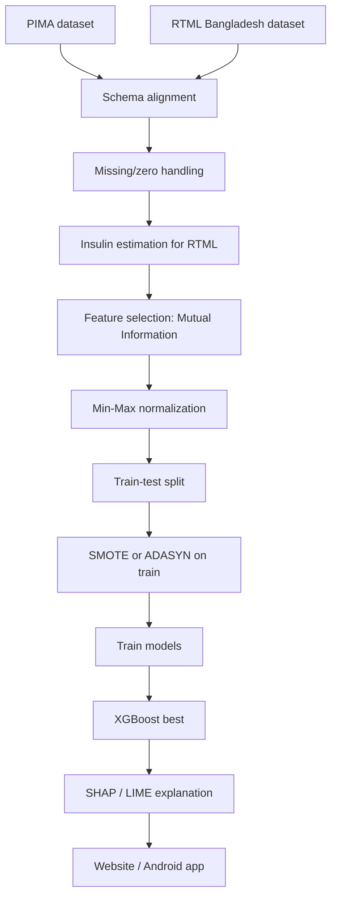
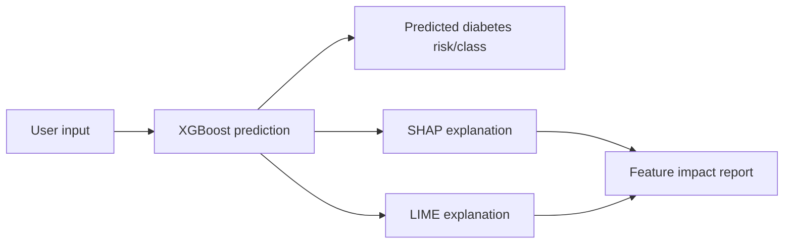
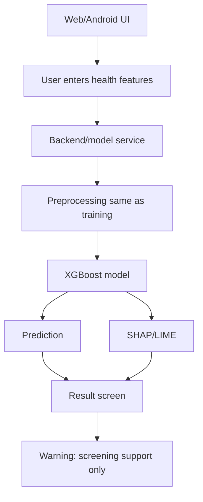

# Architecture - Layer 4: XAI / Triển khai

## Đọc 1 phút

| Thành phần | Nội dung |
|---|---|
| Input | Health features kiểu PIMA |
| Dataset | PIMA + RTML Bangladesh |
| Preprocess | Mean replacement, Min-Max normalization |
| Balance | SMOTE / ADASYN |
| Model best | XGBoost |
| XAI | SHAP + LIME |
| Deployment | Website + Android app |
| Output | Prediction + explanation |

## 1. Input features

| Feature | Ý nghĩa | Có trong PIMA? | Có trong RTML? |
|---|---|---|---|
| Pregnancies | Số lần mang thai | Có | Có |
| Glucose | Plasma glucose | Có | Có (đo bằng GlucoLeader Enhance) |
| BloodPressure | Huyết áp | Có | Có (OMRON HEM-7156T) |
| SkinThickness | Tricep skin fold | Có | Có (digital LCD body fat caliper) |
| Insulin | 2-hour serum insulin | Có | **Không** — paper estimate bằng XGB regressor học trên PIMA |
| BMI | Body mass index | Có | Có |
| DiabetesPedigreeFunction | Yếu tố di truyền/gia đình | Có | Không — bị loại khỏi merged dataset (mutual information thấp nhất) |
| Age | Tuổi | Có | Có (18–77) |
| Outcome | Label diabetes (1/0) | Có | Có |

Ghi chú: Paper dùng XGB regressor được huấn luyện **trên phần PIMA** (chia 8:2, so RMSE với SVR và GPR ở Table 3) để dự đoán insulin cho RTML. Phương án này semi-supervised vì RTML không có nhãn insulin thực.

## 2. Dataset architecture

| Dataset | Vai trò | Rủi ro |
|---|---|---|
| PIMA | Benchmark training/evaluation | Nhỏ, cũ, bias population |
| RTML Bangladesh | Dữ liệu thực địa bổ sung | 203 mẫu, private/small |
| Merged dataset | Tăng diversity | Cần chuẩn hoá schema và domain shift |

## 3. Pipeline tổng thể

| Bước | Module | Output |
|---:|---|---|
| 1 | Load PIMA + RTML | Raw tabular data |
| 2 | Schema alignment | Feature set thống nhất |
| 3 | Handle zero/missing values | Zéro bất thường → mean |
| 4 | Insulin estimation cho RTML | XGB regressor học trên PIMA (RMSE thấp hơn SVR/GPR) |
| 5 | Feature selection (mutual information) | Bỏ `DiabetesPedigreeFunction` |
| 6 | Min-Max normalization | Scaled data |
| 7 | Holdout 8:2 stratified split | Train / test tách rời |
| 8 | SMOTE / ADASYN trên train | Balanced train data, test giữ nguyên |
| 9 | Model training / GridSearchCV tuning | Best classifier |
| 10 | SHAP / LIME trên XGBoost+ADASYN | Explanation |
| 11 | Website / Android | User-facing demo |

## 4. Model candidates

| Model | Vai trò |
|---|---|
| Decision Tree | Baseline dễ hiểu |
| KNN | Distance-based baseline |
| Random Forest | Strong tabular baseline |
| SVM | Margin-based classifier |
| Logistic Regression | Linear baseline |
| AdaBoost | Boosting baseline |
| XGBoost | Best model trong paper |
| Voting Classifier | Ensemble |
| Bagging | Ensemble |

## 5. XAI architecture

| XAI tool | Cách giải thích | Dùng để làm gì |
|---|---|---|
| SHAP | Shapley values, global/local importance | Biết feature nào ảnh hưởng mạnh toàn mô hình và từng case |
| LIME | Local surrogate model | Giải thích dự đoán của một người dùng cụ thể |

## 6. Deployment architecture

| Thành phần | Công nghệ paper mô tả (PMC mục 2.4) |
|---|---|
| Frontend website | HTML / CSS |
| Model development | Python trên Spyder + Anaconda |
| Android app | Android Studio + Java; model nạp qua `pickle` |
| Hosting / API | Heroku |
| Output UI | Prediction result + explanation |
| Survey | 16 tình nguyện viên (nữ) review app; điểm cao nhất cho tính năng prediction (8.40/10) và daily diet chart (8/10) |

## 7. Cảnh báo kiến trúc

| Lỗi dễ mắc | Hậu quả | Cách làm đúng |
|---|---|---|
| SMOTE/ADASYN trước split | Leakage | Split trước, balance train only |
| Normalize full dataset | Test leakage | Fit scaler trên train |
| Predict insulin bằng toàn data | Leakage từ test/domain | Fit regressor trên train/source rõ ràng |
| XAI dùng sai | Người dùng hiểu nhầm là nguyên nhân y khoa | Ghi “model explanation, not causal explanation” |
| Web/app thiếu disclaimer | Rủi ro y khoa | Ghi rõ không thay bác sĩ |
| Deploy model không versioning | Kết quả khó tái lập | Lưu model/scaler/selector version |

## 8. Link liên quan

| Loại | Link |
|---|---|
| DOI | https://doi.org/10.1049/htl2.12039 |
| PMC | https://pmc.ncbi.nlm.nih.gov/articles/PMC10107388/ |
| GitHub | https://github.com/tansin-nabil/Diabetes-Prediction-Using-Machine-Learning |
