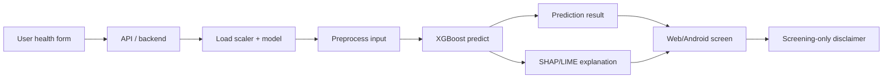

# Deploy / Reproduction - Layer 4: XAI / Triển khai

## Đọc 1 phút

| Muốn làm lại cần gì? | Trả lời |
|---|---|
| Dataset | PIMA + RTML/GitHub dataset |
| Model | XGBoost |
| Imbalance | SMOTE / ADASYN |
| XAI | SHAP + LIME |
| Demo | Website hoặc Android |
| Metric chính | Accuracy, F1-score, AUC |
| Cẩn thận nhất | Data leakage + medical disclaimer |

## 1. Mục tiêu tái lập

| Mục tiêu | Có/không |
|---|---|
| Tái lập preprocessing | Có |
| Tái lập XGBoost | Có |
| Tái lập SHAP/LIME | Có |
| Tái lập web demo | Có |
| Tái lập Android app | Có nếu biết Java/Android Studio |
| Dùng lâm sàng | Không |

## 2. Input cần chuẩn bị

| Nhóm | Cần chuẩn bị |
|---|---|
| Data | PIMA CSV + RTML/private dataset từ GitHub |
| Python libs | pandas, numpy, scikit-learn, xgboost, imbalanced-learn, shap, lime |
| Web | Flask/FastAPI hoặc Streamlit; paper dùng HTML/CSS + Python |
| Android | Android Studio, Java |
| Hosting | Heroku hoặc platform thay thế |
| Artifacts | model.pkl, scaler.pkl, feature selector, XAI explainer |

## 3. Checklist tái lập

| Bước | Việc làm | Ghi chú |
|---:|---|---|
| 1 | Clone GitHub | Kiểm tra code/data thật |
| 2 | Load PIMA + RTML | Kiểm tra schema (RTML thiếu Insulin và DiabetesPedigreeFunction) |
| 3 | Insulin estimator | Train XGB regressor **chỉ trên PIMA** (so RMSE với SVR/GPR), predict insulin cho RTML |
| 4 | Merge datasets | Loại `DiabetesPedigreeFunction` (mutual information thấp nhất) |
| 5 | Handle zero/missing | Zéro bất thường (BMI=0, SkinThickness=0…) → mean |
| 6 | Stratified holdout 8:2 split | Trước balancing/scaling fit |
| 7 | Fit Min-Max scaler trên train | Transform train + test |
| 8 | Apply SMOTE / ADASYN train only | Không balance test |
| 9 | Train models | DT, KNN, RF, SVM, LR, AdaBoost, XGBoost, Voting, Bagging |
| 10 | Tune bằng GridSearchCV | Mỗi model có hyperparameter riêng (xem PMC mục 2.3) |
| 11 | Evaluate | Accuracy, precision, recall, F1, AUC trên test giữ nguyên |
| 12 | Generate SHAP | Global + local explanation trên XGBoost+ADASYN |
| 13 | Generate LIME | Case-level explanation |
| 14 | Save artifacts | Model + preprocessors với `pickle` |
| 15 | Build UI | Web (HTML/CSS) hoặc Android (Java) |
| 16 | Add disclaimer | Screening only, not diagnosis |

## 4. Pseudocode gọn

```python
pima = load_csv("pima.csv")           # 768 mẫu, 8 feature
rtml = load_csv("rtml.csv")           # 203 mẫu, 6 feature, thiếu insulin

# 1) Insulin estimator: huấn luyện CHỈ trên PIMA để tránh leakage
X_pima = pima.drop(columns=["Outcome", "Insulin"])
y_pima_insulin = pima["Insulin"]
X_pima_tr, X_pima_va, y_pima_tr, y_pima_va = train_test_split(
    X_pima, y_pima_insulin, test_size=0.2, random_state=42
)
insulin_regressor = XGBRegressor().fit(X_pima_tr, y_pima_tr)
# (Paper so RMSE với SVR + GPR ở Table 3, chọn XGBR)
rtml["Insulin"] = insulin_regressor.predict(rtml.drop(columns=["Outcome"]))

# 2) Gộp dataset, loại DiabetesPedigreeFunction (Mutual Information thấp nhất)
data = align_schema_and_merge(pima, rtml).drop(
    columns=["DiabetesPedigreeFunction"]
)
data = replace_invalid_zero_values_with_mean(data)

X, y = split_features_label(data, label="Outcome")

# 3) Stratified holdout 8:2
X_train, X_test, y_train, y_test = train_test_split(
    X, y, test_size=0.2, stratify=y, random_state=42
)

# 4) Scaler fit trên train
scaler = MinMaxScaler().fit(X_train)
X_train = scaler.transform(X_train)
X_test = scaler.transform(X_test)

# 5) ADASYN chỉ trên train
X_train, y_train = ADASYN(random_state=42).fit_resample(X_train, y_train)

# 6) Train XGBoost + GridSearchCV
model = GridSearchCV(
    XGBClassifier(random_state=42),
    param_grid=xgb_params,
    scoring="roc_auc",
    cv=5,
)
model.fit(X_train, y_train)

prob = model.predict_proba(X_test)[:, 1]
pred = prob >= 0.5
metrics = evaluate(y_test, pred, prob)

# 7) XAI trên tập test
shap_explainer = shap.TreeExplainer(model.best_estimator_)
shap_values = shap_explainer.shap_values(X_test)

lime_explainer = lime.lime_tabular.LimeTabularExplainer(X_train)
lime_report = lime_explainer.explain_instance(
    X_test[0], model.predict_proba
)

save_artifacts(model, scaler, shap_explainer, lime_explainer)
```

## 5. Sơ đồ triển khai web/app



## 6. Gợi ý demo dễ làm hơn paper

| Demo | Cách làm | Ưu điểm |
|---|---|---|
| Streamlit | 1 Python app | Nhanh, đẹp, dễ thuyết trình |
| Flask + HTML | Form + endpoint `/predict` | Gần paper |
| FastAPI | API rõ ràng | Dễ nối mobile |
| Android mock | App gọi API | Giống paper nhất |

## 7. Cảnh báo bắt buộc

| Cảnh báo | Vì sao |
|---|---|
| Không chẩn đoán y khoa | App chỉ hỗ trợ sàng lọc |
| Không balance trước split | Leakage |
| Không fit scaler full data | Leakage |
| Không dùng SHAP/LIME như causal proof | Chỉ giải thích model behavior |
| Không che giấu dataset nhỏ | RTML chỉ 203 mẫu |
| Không hardcode medical advice | Người dùng cần gặp bác sĩ |
| Không deploy public nếu chưa privacy/security | Dữ liệu sức khỏe nhạy cảm |
